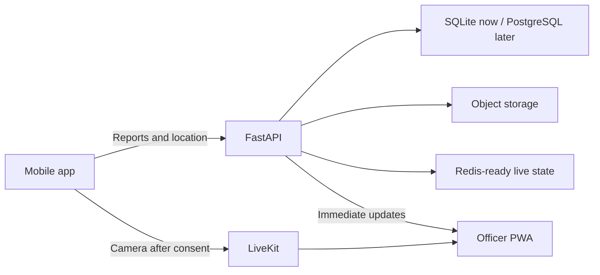

# Architecture

HTTP routes only validate input, establish identity, and shape responses. Services own priority, routing, workflow, atomic assignment, and notifications. SQLAlchemy models isolate persistence. `RoutingService` is the swap point for future PostGIS routing; LiveKit and local evidence storage sit behind similarly narrow boundaries.

A report is first routed to an office. Active members receive an immediate update. The first valid acknowledgement atomically assigns an officer; later actions require that officer. Every meaningful action adds report history and, where sensitive, an audit record.

